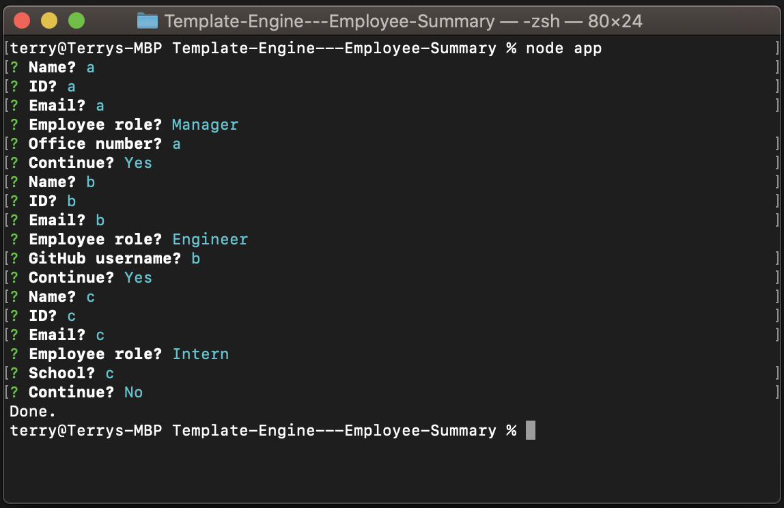

# Template-Engine---Employee-Summary
This application will quickly generate a webpage that displays your team's basic info. When you add your team member, you can choose from "Manager", "Engineer", and "Intern". Besides the basic infomation: name, ID, and Email. You will also enter a specific infomation for that particular role. Office number for manager, github username for engineer, and school for intern. 

- [Setup](#setup)
- [Credit](#credit)
- [Link](#link)
- [License](#license)

## Setup
In terminal "npm i" to install necessary components. To run it, type "node app" in terminal. 

## Credit
Node.js

Inquirer

Jest

## Link
[Template Engine - Employee Summary](https://github.com/Terry0532/Template-Engine---Employee-Summary)

## Screenshot

## License

[MIT License](https://choosealicense.com/licenses/mit/)